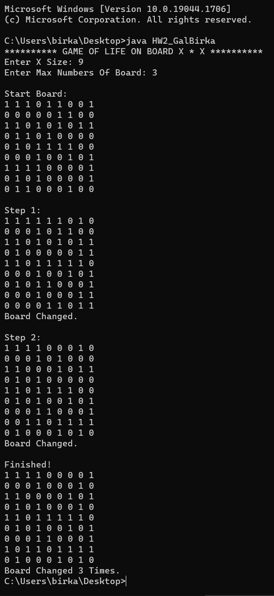

# ⬜⬛ Game Of Life ⬛⬜

Back in 2018, during my first semester at college on an Introduction to Computer Science course, which was my first real experience with programming, a new world (back there) that I have been living inside in the past few years. This course was taught in Java language, and one of the first homework assignments we had was making a [`Game of Life`](https://en.wikipedia.org/wiki/Conway%27s_Game_of_Life) in the terminal. I remember the joy of completing it and watching the game of life play in my terminal.

After 4 years, with a B.Sc Software Engineer degree, I looked back at where I started and re-lived that moment. I found the original assignment (and solution, which got a perfect 100 grade) and since I need to sharpen my React skills, I thought it would be fun to try and re-create the game in the "correct" way with the knowledge I collected during those 4 years. It took me way less time then the original one, and it looks wayyy better.  

I think looking back at where you started, and reflecting on where you are now is good exercise and can help you understand the tremendous path you've made. In day to day life you don't really have time to appreciate the progress you have made and, for me, this was a good reminder of that and I feel proud of it.

So you can take a look at the original [`assignment`](original_game_of_life/HW2.pdf) and [`solution`](original_game_of_life/HW2_GalBirka.java) and I invite you to check out the new, updated and improved version I re-created at 🌐 [`birkagal.com/game-of-life`](https://www.birkagal.com/game-of-life)

